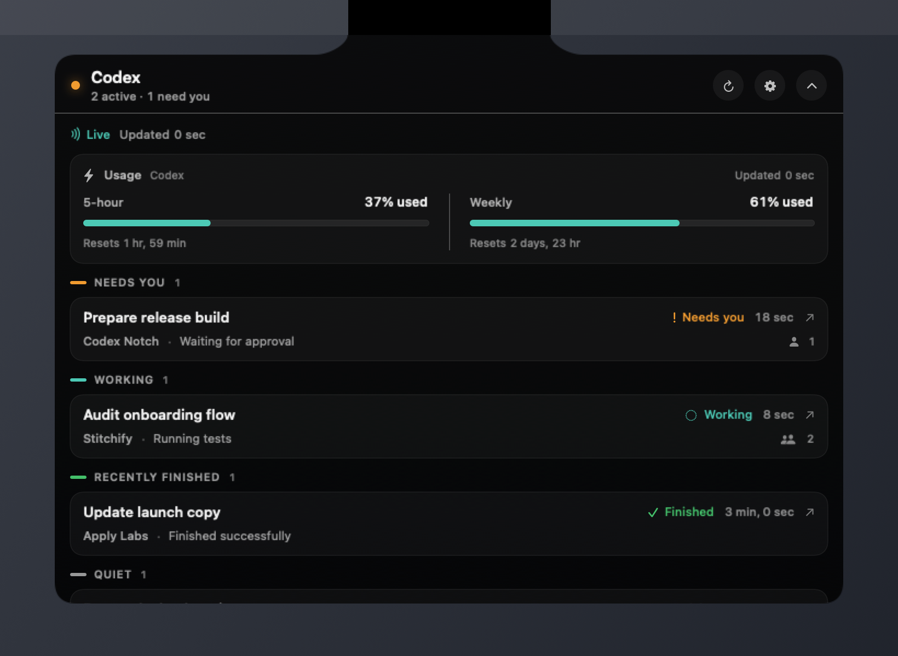
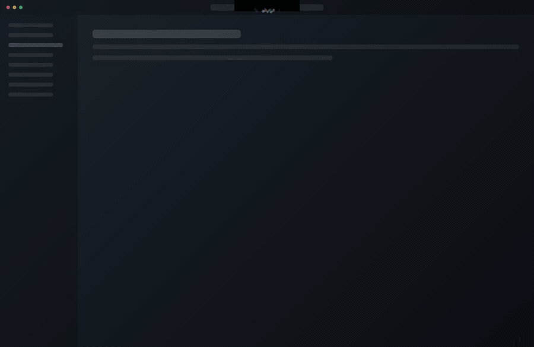

# Codex Notch

An unofficial, read-only macOS companion that keeps your active Codex tasks,
agent counts, completion events, and locally observed usage windows one glance
away at the notch.

> Codex Desktop is where you work. Codex Notch is where you glance.

<p align="center">
  
  
  
</p>

Codex Notch is a native SwiftUI and AppKit menu-bar app. It turns the MacBook
camera area into a quiet status surface for people running Codex across several
projects at once—without starting another Codex runtime or touching Codex state.

## Preview

### Resting notch

The compact surface stays tucked around the camera and only shows what needs
your attention.

<p align="center">
  
</p>

### Open dashboard

Expand it to see active tasks, child-agent counts, recent completions, and the
latest locally observed usage windows across projects.

<p align="center">
  
</p>

### Completion animation

When a task finishes, a brief screen-wide celebration names the project while
the rest of your work keeps running.

<p align="center">
  
  <br>
  <sub>All previews use deterministic demo data.</sub>
</p>

## Highlights

- Watches the 12 most recent primary Codex tasks across local projects.
- Separates working, approval-needed, answer-needed, completed, interrupted,
  stale, and unverified states using explicit local lifecycle evidence.
- Counts active child agents from their own open-turn evidence.
- Shows the latest rate-limit windows and reset times observed in local Codex
  rollouts; it does not invent percentages or ETAs.
- Opens the exact task in Codex through `codex://threads/<thread-id>`.
- Turns approval and answer requests into a taller amber notch alert with a
  persistent animated robot, using explicit request events so automatically
  reviewed escalated commands do not create false alerts.
- Celebrates genuine completions with a click-through, Reduce Motion-aware
  animation that names the finished project. Choose Full screen, Notch only,
  or Off, with a separate override while Codex is frontmost.
- Supports Privacy Mode, Quiet Mode with an urgent approval/answer bypass,
  opt-in notifications, always-available menu-bar controls, and a top-center
  fallback on displays without a notch.
- Makes no network requests and never writes to Codex's database or rollout
  files.

## How it works

```text
~/.codex/state_5.sqlite       referenced rollout JSONL files
            \                         /
             read-only local repository
                       |
              lifecycle classifier
                       |
        compact notch + dashboard + notifications
```

The app opens `~/.codex/state_5.sqlite` in SQLite read-only mode, finds recent
primary tasks and their child relationships, and reads bounded portions of the
referenced rollout files. It consumes lifecycle events, fixed activity kinds,
and rate-limit snapshots—not raw prompt, reasoning, command, or tool-output
content.

Polling happens locally every two seconds, increasing to twice per second while
a task needs attention. Unchanged rollout files are cached, unknown event types
are ignored, and inaccessible or incompatible data becomes a visible degraded
state rather than a guessed status.

For the exact data boundary, see [the technical notes](docs/technical-notes.md).

## Requirements

- macOS 14 or newer
- Codex Desktop installed locally
- Xcode with Swift 6 support
- [XcodeGen](https://github.com/yonaskolb/XcodeGen)

This repository currently provides a build-from-source developer release. It
does not yet include a signed, notarized download or automatic updates.

## Build and run

```sh
brew install xcodegen

git clone https://github.com/yazmorukyaz/codex-notch.git
cd codex-notch

xcodegen generate
xcodebuild \
  -project CodexNotch.xcodeproj \
  -scheme CodexNotch \
  -destination 'platform=macOS' \
  -derivedDataPath build/App \
  build

open 'build/App/Build/Products/Debug/Codex Notch.app'
```

The app runs as a menu-bar accessory (`LSUIElement`) and does not appear in the
Dock. Open its menu-bar item to reach the dashboard and settings.

## Tests

Run the deterministic Core test suite:

```sh
xcodebuild \
  -project CodexNotch.xcodeproj \
  -scheme CodexNotchCoreTests \
  -destination 'platform=macOS' \
  -derivedDataPath build/Tests \
  test
```

The main scheme also contains a macOS UI test, which requires an interactive
GUI session with UI automation available.

## Privacy and trust boundary

Codex rollouts can contain sensitive material, so the reader intentionally
extracts only the minimum metadata needed for status display. In particular:

- the database is opened with `SQLITE_OPEN_READONLY`;
- raw prompts, reasoning, commands, and tool output are not presented;
- no telemetry, cloud sync, or background API is included;
- Privacy Mode replaces task, project, activity, and completion identity with
  generic labels;
- approvals, replies, task creation, and task editing remain in Codex Desktop.

The app is unsandboxed because Apple's App Sandbox would prevent it from
reading Codex's local files. That access is the reason the source is deliberately
small and the data contract is documented.

## Limitations

- Codex Notch is experimental and depends on undocumented local Codex storage
  schemas. A Codex update may require parser changes.
- The view is intentionally bounded to 12 primary tasks and up to 24 child
  agents per task; it is not an account-history browser.
- Status reflects local evidence. When lifecycle evidence cannot be verified,
  the app shows Unverified or Stale instead of guessing.
- It supervises tasks but does not control them, answer approval requests, or
  replace the Codex Desktop interface.

## Project structure

```text
Sources/Core/                 read-only repository, parsing, classification
Sources/App/                  SwiftUI surfaces and AppKit panel coordination
Tests/CoreTests/              deterministic parser, state, and geometry tests
Tests/UITests/                expanded-surface UI regression test
docs/                         data contract and design notes
remotion-celebrations/        frame-driven completion-motion studies
project.yml                   XcodeGen project definition
```

## Completion motion lab

The motion studies in [`remotion-celebrations`](remotion-celebrations/README.md)
make the completion timelines deterministic and easy to compare. The shipping
effect uses `TimelineView` and ordinary SwiftUI particle views inside a
transparent, click-through `NSPanel`, so it does not activate or block the app
underneath it.

## Contributing

Issues and focused pull requests are welcome. Please keep the core guarantees
intact: local-only, read-only, evidence-based status, and graceful behavior when
Codex's internal schemas change.

Before opening a pull request, regenerate the Xcode project and run the Core
tests shown above. If you change the completion motion, also run:

```sh
cd remotion-celebrations
npm ci
npm run lint
```

## License

No open-source license has been selected yet. The repository is public for
inspection and collaboration, but no redistribution license is granted unless
a license file is added later.

## Disclaimer

Codex Notch is an independent community project. It is not affiliated with,
sponsored by, or endorsed by OpenAI.
